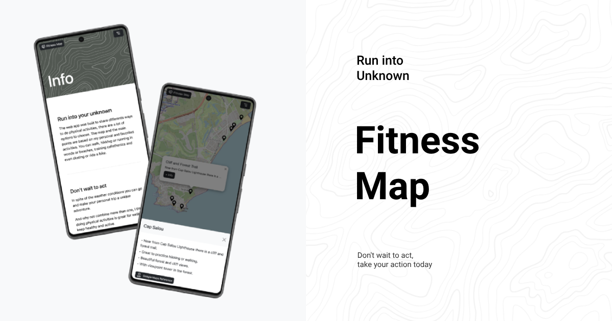

# Fitness Map

Web App based on OpenStreet Maps to show physical activities with descprition on a location and also has an info tab.


## Techstack

Built with only html, css and javascript. 

The web app uses Leaflet maps library to load and use chords with maps, javascript modules for UI and user events and bootstrap style guide to structure the info.


#### Development environment: 
- **esbuilt**: minify, build and hot reload (javascript, css)
- **liveServer**: from vscode extension

## Installation

Use your favorite package manager to install.

```bash
npm install
```

## Usage

Open the project in your code editor, split the console

In one tab run the command to build the app and start the watch mode

```bash
npm run build
```

Open the `index.html` file with live reload on the browser.

## Contributing

Pull requests are welcome. For major changes, please open an issue first
to discuss what you would like to change.

Please make sure to update tests as appropriate.
